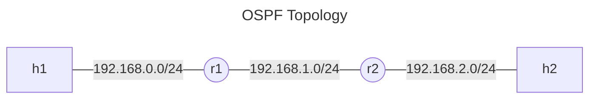
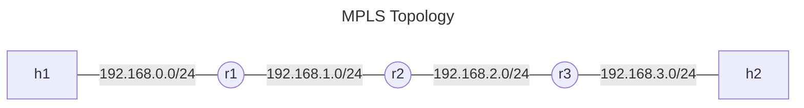
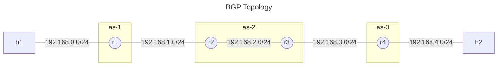
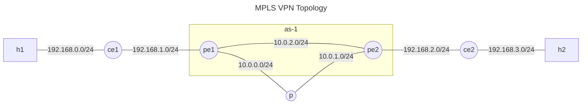
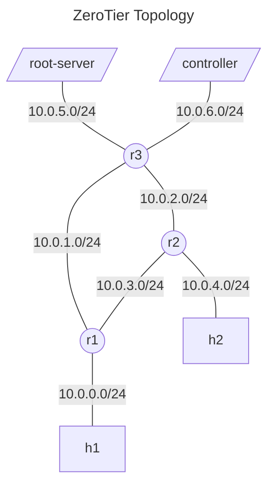

---
references:
  - http://mininet.org/vm-setup-notes/
  - https://bytealmanac.wordpress.com/2012/07/02/assigning-a-static-ip-to-a-vmware-workstation-vm/
  - https://www.xmodulo.com/how-to-launch-vmware-player-vms-without-gui.html
  - https://deb.frrouting.org/
  - https://www.researchgate.net/publication/338229266_Fault_Tolerance_in_SDN_Data_Plane_Considering_Network_and_Application_Based_Metrics
  - https://dlqs.dev/frr-local-netns-setup.html
  - https://github.com/mininet/mininet/wiki/Introduction-to-Mininet
  - https://docs.frrouting.org/en/latest/setup.html
  - https://opensource.com/article/20/12/multiple-service-instances-systemctl
  - https://docs.frrouting.org/projects/dev-guide/en/latest/building-frr-for-ubuntu2004.html
  - https://www.cisco.com/c/en/us/td/docs/ios-xml/ios/mp_ldp/configuration/15-s/mp-ldp-15-s-book/mp-ldp-igp-synch.pdf
  - https://www.waren.vn/chuyen-de/cau-hinh-co-ban-bgp-voi-cisco-ios.html
  - https://docs.frrouting.org/en/latest/bgp.html
  - https://techhub.hpe.com/eginfolib/networking/docs/switches/5930/5200-4579_l3-ip-rtng_cg/content/491335171.htm
  - https://www.kernel.org/doc/Documentation/networking/vrf.txt
  - https://www.cisco.com/c/en/us/support/docs/multiprotocol-label-switching-mpls/mpls/13733-mpls-vpn-basic.html
  - https://thegioimang.vn/dien-dan/threads/t%C3%ACm-hi%E1%BB%83u-v%C3%A0-c%E1%BA%A5u-h%C3%ACnh-mpls-vpn-v%E1%BB%9Bi-static-route-v%C3%A0-rip.504/
  - https://github.com/zerotier/ZeroTierOne
  - https://docs.zerotier.com/zerotier/manual
  - https://docs.zerotier.com/zerotier/moons/
  - https://viblo.asia/p/mo-phong-sdn-bang-mininet-va-onos-phan-2-thuc-hanh-mo-phong-sdn-bWrZn62pZxw
  - https://docs.zerotier.com/self-hosting/network-controllers
---

# Mininet và FRRouting

- [Công nghệ sử dụng](#công-nghệ-sử-dụng)
  - [Mininet](#mininet)
  - [FRRouting](#frrouting)
  - [ZeroTier](#zerotier)
- [Lab: OSPF](#lab-ospf)
  - [Mô tả](#mô-tả)
  - [Quá trình triển khai](#quá-trình-triển-khai)
  - [Thực thi](#thực-thi)
- [Lab: MPLS](#lab-mpls)
  - [Mô tả](#mô-tả-1)
  - [Quá trình triển khai](#quá-trình-triển-khai-1)
  - [Thực thi](#thực-thi-1)
- [Lab: BGP](#lab-bgp)
  - [Mô tả](#mô-tả-2)
  - [Quá trình triển khai](#quá-trình-triển-khai-2)
  - [Thực thi](#thực-thi-2)
- [Lab: MPLS VPN](#lab-mpls-vpn)
  - [Mô tả](#mô-tả-3)
  - [Quá trình triển khai](#quá-trình-triển-khai-3)
  - [Thực thi](#thực-thi-3)
- [Lab: ZeroTier](#lab-zerotier)
  - [Mô tả](#mô-tả-4)
  - [Quá trình triển khai](#quá-trình-triển-khai-4)
  - [Thực thi](#thực-thi-4)
- [Phụ lục](#phụ-lục)
  - [Cài đặt](#cài-đặt)
    - [Môi trường](#môi-trường)
    - [Tạo và sử dụng máy ảo với Vagrant](#tạo-và-sử-dụng-máy-ảo-với-vagrant)
  - [Tích hợp với Visual Studio Code](#tích-hợp-với-visual-studio-code)
  - [Sử dụng switch truyền thống](#sử-dụng-switch-truyền-thống)
  - [Test hiệu năng mạng với `iperf3`](#test-hiệu-năng-mạng-với-iperf3)

---

## Công nghệ sử dụng

### [Mininet](https://github.com/mininet/mininet/wiki/Introduction-to-Mininet)

Mininet sử dụng các chức năng của nhân Linux để tạo và quản lý mạng ảo chứa các
các host, switch, và link. Các thiết bị ảo này chia sẻ chung nhân Linux
của hệ điều hành thật và có thể vận hành như thiết bị thật.

Host trong Mininet là một tập các process được đặt trong một network namespace
do Mininet tạo ra. Trong network namespace này, Mininet cũng tạo ra các
interface ảo là các interface của host. Như vậy, ở trong network namespace, tập
các process này chỉ nhìn thấy các interface ảo mà Mininet tạo ra cũng như chỉ
nhìn thấy các tài nguyên mạng khác độc lập cho riêng chúng, ví dụ như bảng định
tuyến.

Switch trong Mininet sử dụng [Linux bridge](#sử-dụng-switch-truyền-thống) hoặc
Open vSwitch để chuyển packet giữa các interface.

Link trong Mininet là cặp veth với mỗi veth đặt ở một namespace. Packet truyền
vào veth này sẽ đi ra veth kia. Do đó kết nối được hai namespace hay hai node
trong Mininet.

### FRRouting

Trong Mininet, không có thiết bị router mà một host có thể đảm nhiệm việc định
tuyến nếu kích hoạt tính năng IP forward (`sysctl -w net.ipv4.ip_forward=1`) của
Linux kernel.

Do Linux kernel không cài đặt sẵn các thuật toán định tuyến của router nên ta sử
dụng FRRouting để có thể mô phỏng router trong Mininet. FRRouting là một bộ các
thuật toán định tuyến mã nguồn mở dành cho Linux được phát triển từ dự án mã
nguồn mở Quagga.

Ngoài ra, FRRouting cũng cung cấp giao diện `vtysh` khá tương đồng với giao diện
dòng lệnh của Cisco IOS giúp quá trình sử dụng, cấu hình việc định tuyến được
thuận tiện, dễ dàng.

### ZeroTier

ZeroTier là một giải pháp SD-WAN cho phép dựng mạng overlay kết nối các thiết bị
trên Internet. Mạng ZeroTier chia làm hai tầng, VL1 được coi là đường dây ảo và
VL2 là lớp giả lập mạng Ethernet thông thường.

VL1 được tổ chức phân cấp. A khi muốn gửi packet đến B đầu tiên sẽ gửi packet đó
tới một root server mà nó có kết nối ngang hàng. Nếu root server đó không có kết
nối ngang hàng với B, nó sẽ gửi packet lên root server cấp cao hơn. Đến tận cùng
thì packet sẽ được gửi đến root server cấp cao nhất được vận hành bởi ZeroTier.
Tập root server này biết về mọi thiết bị trong mạng nên cuối cùng packet sẽ được
chuyển tới B. Ngoài ra, thông tin để kết nối với B sẽ được gửi cho A và ngược
lại. Sau đó, hai node này có thể thực hiện tạo kết nối ngang hàng trực tiếp với
nhau.

Các root server được xác định bởi định nghĩa về world. Có hai loại định nghĩa
world là planet và moon. Chỉ có duy nhất một planet là tập các root server được
vận hành bởi ZeroTier. Các moon là các tập root server người dùng tự quản lý.
Các node thuộc một world thì gọi là xoay quanh planet hoặc moon của world đó.

Packet đi trong VL1 sẽ được mã hóa đầu cuối. Hai node sẽ bắt đầu với việc trao
đổi public key của mình qua các packet `HELLO` không được mã hóa. Sau đó, hai
node thực hiện trao đổi khóa Diffie-Hellman thiết lập khóa chung bằng cách kết
hợp public key của node kia và private key của bản thân.

VL2 là lớp giả lập mạng Ethernet nằm trên VL1. Tại VL2 sẽ có các mạng VLAN được
quản lý bởi các node là các controller. Khi một node gia nhập một VLAN, nó sẽ
gửi yêu cầu cấu hình đến controller của VLAN đó. Controller sẽ xác thực và gửi
lại node thông tin cấu hình, thông tin routing. Địa chỉ MAC của node trong một
mạng VLAN được tạo bởi địa chỉ ZeroTier của node và network ID. Do đó để các
node trong mạng tìm ra địa chỉ ZeroTier của nhau, chúng sử dụng ARP như trong
một mạng VLAN bình thường để lấy địa chỉ MAC và dịch ngược lại về địa chỉ
ZeroTier. Địa chỉ này dùng để giao tiếp trong VL1.

## Lab: OSPF

### Mô tả

Bài lab này sử dụng Mininet và FRRouting để triển khai topology như sơ đồ dưới
đây. Trong topology này, `r1` và `r2` sẽ chạy thuật toán định tuyến OSPF.



### Quá trình triển khai

Ý tưởng thực hiện bài lab cơ bản là tạo topology 2 host, 2 router trong Mininet,
sau đó chạy FRRouting trong 2 router và cấu hình OSPF.

Mỗi host cần chạy một phiên bản của FRRouting để có thể định tuyến độc lập.
Thông thường, FRRouting được khởi động bằng tiến trình `init` của Linux ví dụ
như `systemd`. Để chạy nhiều phiên bản của FRRouting trong cùng một máy, nếu
dùng `systemd`, ta cần tạo file `service` cho `systemd` với cấu hình để các tiến
trình của FRRouting được đặt vào đúng network namespace do Mininet tạo ra. Ngoài
ra, cũng cần sửa mount namespace hoặc cấu hình trong file `service` cho mỗi host
để mỗi phiên bản của FRRouting có thể sử dụng file cấu hình riêng cho nó.

FRRouting cũng cung cấp cách thức để chạy nhiều phiên bản trên nhiều network
namespace trong cùng một máy. Ta tạo thư mục lưu trữ cấu hình mới là
`/etc/frr/[pathspace]` (thường đặt tên trùng với network namespace) sau đó kích
hoạt tùy chọn
[`watchfrr_options`](https://docs.frrouting.org/en/latest/setup.html#network-namespaces)
trong file cấu hình các daemon của FRRouting `/etc/frr/[pathspace]/daemons` với
tham số là tên network namespace. Khi sử dụng tùy chọn này, ta phải khởi chạy
FRRouting thủ công bằng lệnh sau:

```bash
/etc/init.d/frr start [pathspace]
```

Do việc khởi chạy thủ công này không được quản lý bởi `systemd` nên ta cũng cần
phải tắt các tiến trình một cách thủ công như sau:

```bash
ps aux | grep [network_namespace] | awk '!/grep/ {print $2}' - |
    xargs --max-args 1 --no-run-if-empty kill -KILL
```

Để cấu hình OSPF, sau khi [kích hoạt IP forwarding](#frrouting) và cấu hình địa
chỉ IP cho các interface ta chạy lệnh sau trong `vtysh` cho mỗi router:

```plaintext
configure terminal
router ospf
network [network-address]/[prefix-length] area 1
end
```

Trong trường hợp SSH vào Mininet VM và sử dụng X forwarding, ta theo dõi packet
đi qua các interface của các host trong mininet như sau:

```bash
# wireshark cannot connect to localhost (display server) when it is in the
# network namespace created by Mininet

# tcpdump write to stdout (`-w -`)
# wireshark read from stdin (`--interface -`)
sudo nsenter --net=/var/run/netns/[namespace] \
    tcpdump --interface [intf] -w - --packet-buffered |
    sudo --preserve-env wireshark -k --interface -
```

### Thực thi

Thực thi bằng Python:

```bash
sudo --preserve-env python3 main.py ospf
```

<details><summary>Thực thi và cấu hình router thủ công</summary>
<p>

```bash
#===============================================================================
# In host
#===============================================================================
# Enable IP forward (allows the linux kernel to forward ipv4 packets incoming
# from one interface to an outgoing interface)
echo 'net.ipv4.ip_forward=1' > '/etc/sysctl.d/enable-ip-forward.conf'
# Apply immediately
sysctl -w net.ipv4.ip_forward=1

export NETNS1=r1netns
export NETNS2=r2netns

cat <<EOF | tee /tmp/topo.py
from mininet.topo import Topo

class SimpleTopo(Topo):
    def build(self):
        # Add hosts and routers
        left_host = self.addHost('h1')
        right_host = self.addHost('h2')
        left_router = self.addHost('r1')
        right_router = self.addHost('r2')

        # Add links
        self.addLink(left_host, left_router)
        self.addLink(left_router, right_router)
        self.addLink(right_router, right_host)

topos = {'simpletopo': (lambda: SimpleTopo())}
EOF

sudo --preserve-env mn --custom /tmp/topo.py --topo simpletopo --controller none

#===============================================================================
# In mininet cli
#===============================================================================
# Remove IPs
r1 ip address flush dev r1-eth0
r1 ip address flush dev r1-eth1
r2 ip address flush dev r2-eth0
r2 ip address flush dev r2-eth1
h2 ip address flush dev h2-eth0
h1 ip address flush dev h1-eth0

sh mkdir --parents /var/run/netns/

# Create link of network namespace in /var/run/netns so it can be seen by `ip`
# utility and FRRouting
r1 ln --symbolic --no-target-directory /proc/$$/ns/net /var/run/netns/$NETNS1
r2 ln --symbolic --no-target-directory /proc/$$/ns/net /var/run/netns/$NETNS2

#-------------------------------------------------------------------------------
# Start daemons
#-------------------------------------------------------------------------------
# See: https://dlqs.dev/frr-local-netns-setup.html
sh bash
for NETNS in $NETNS1 $NETNS2; do
    mkdir /etc/frr/$NETNS/
    # Copy only files
    find /etc/frr -maxdepth 1 -type f -execdir cp {} /etc/frr/$NETNS ';'
    sed --in-place 's/ospfd=no/ospfd=yes/' /etc/frr/$NETNS/daemons
    sed --in-place \
        "s/#watchfrr_options=\"\"/watchfrr_options=\"--netns $NETNS\"/" \
        /etc/frr/$NETNS/daemons
    # Set vtysh hostname to "r#" (substring of "r#netns")
    echo "hostname ${NETNS:0:2}" >> /etc/frr/$NETNS/vtysh.conf
    /usr/lib/frr/frrinit.sh start $NETNS
done
# Exit to mininet cli
exit

#-------------------------------------------------------------------------------
# Setup OSPF
# Topo:
# h1-eth0<->r1-eth0 192.168.0.0/24
# r1-eth1<->r2-eth0 192.168.1.0/24
# r2-eth1<->h2-eth0 192.168.2.0/24
#-------------------------------------------------------------------------------
sh bash

vtysh --pathspace $NETNS1

# In vtysh for r1
configure terminal
interface r1-eth0
ip address 192.168.0.1/24
exit
interface r1-eth1
ip address 192.168.1.1/24
exit
router ospf
network 192.168.0.0/16 area 1
end
exit

vtysh --pathspace $NETNS2

# In vtysh for r2
configure terminal
interface r2-eth0
ip address 192.168.1.2/24
exit
interface r2-eth1
ip address 192.168.2.1/24
exit
router ospf
network 192.168.0.0/16 area 1
end
exit

# Exit to mininet cli
exit

# Setup hosts' addresses
h1 ip address add 192.168.0.2/24 dev h1-eth0
h1 ip route add default via 192.168.0.1 dev h1-eth0

h2 ip address add 192.168.2.2/24 dev h2-eth0
h2 ip route add default via 192.168.2.1 dev h2-eth0

#-------------------------------------------------------------------------------
# Test
#-------------------------------------------------------------------------------

h1 ping 192.168.2.2

#-------------------------------------------------------------------------------
# Cleanup
#-------------------------------------------------------------------------------
sh bash
for NETNS in $NETNS1 $NETNS2; do
    ps aux | grep $NETNS | awk '!/grep/ {print $2}' - |
        xargs --max-args 1 --no-run-if-empty kill -KILL
    rm --recursive /var/run/netns/$NETNS /etc/frr/$NETNS/
done
# Exit to mininet cli
exit

#===============================================================================
# In host
#===============================================================================
sudo mn --clean
```

</p>
</details>

## Lab: MPLS

### Mô tả

Bài lab này sử dụng Mininet và FRRouting để triển khai topology như sơ đồ dưới
đây. Trong topology này, `r1`, `r2` và `r3` sẽ định tuyến bằng MPLS. Việc gán
nhãn dựa trên bảng định tuyến được xây dựng bởi thuật toán định tuyến OSPF.



### Quá trình triển khai

Đầu tiên ta cần kích hoạt module MPLS của Linux kernel bằng lệnh `modprobe
mpls-router mpls-iptunnel`.

Ta bắt đầu với việc cấu hình OSPF cho 3 router giống như [bài Lab
OSPF](#lab-ospf). Tiếp theo, trong mỗi host (network namespace), ta cần kích
hoạt tính năng [MPLS
forwarding](https://docs.frrouting.org/projects/dev-guide/en/latest/building-frr-for-ubuntu2004.html)
của Linux kernel cho mỗi interface như sau:

```bash
sysctl -w net.mpls.conf.[interface-1].input=1
sysctl -w net.mpls.conf.[interface-2].input=1
sysctl -w net.mpls.platform_labels=100000
```

Ta kích hoạt [MPLS LDP IGP
Synchronization](https://www.cisco.com/c/en/us/td/docs/ios-xml/ios/mp_ldp/configuration/15-s/mp-ldp-15-s-book/mp-ldp-igp-synch.pdf)
để ngăn chặn tình trạng packet loss do thiếu đồng bộ giữa MPLS và IGP (VD:
OSPF). Sau đó, ta cấu hình MPLS cho mỗi router:

```plaintext
configure terminal
router ospf
mpls ldp-syn
exit

mpls ldp
address-family ipv4
discovery transport-address [address-that-used-for-communicating-with-neighbors]
interface [interface-1]
exit
interface [interface-2]
exit
```

Ngoài ra, cần tăng MTU của interface lên. Maximum Transmission Unit (MTU) là
kích thước lớn nhất mà Ethernet frame có thể mang, được chuẩn xác định là 1500
byte. Tương ứng, gói tin sử dụng giao thức TCP sẽ có Maximum Segment Size (MSS)
là 1460 byte để cộng với TCP header và IP header ra 1500 byte. Label (kích thước
4 byte) cũng là một phần payload của Ethernet frame. Vì vậy, tổng kích thước của
gói tin và các label cũng không được vượt quá MTU. Tức là MTU cần tăng hoặc TCP
MSS cần giảm. Tăng MTU của interface như sau:

```bash
ip link set dev [interface] mtu 1600
```

Với thông số mặc định, việc [kiểm tra kết nối TCP bằng
iperf](#test-hiệu-năng-mạng-với-iperf3) sẽ thất bại.

### Thực thi

Thực thi bằng Python:

```bash
sudo --preserve-env python3 main.py mpls
```

## Lab: BGP

### Mô tả

Bài lab này sử dụng Mininet và FRRouting để triển khai topology như sơ đồ dưới
đây. Trong topology này, `r1`, `r2`, `r3` và `r4` sẽ được phân vào 3 AS như
trong sơ đồ. Các AS này trao đổi thông tin định tuyến với nhau bằng BGP. AS2
chứa `r2` và `r3` sẽ sử dụng IGP là OSPF. AS1 và AS3 sẽ lần lượt quảng bá các
mạng `192.168.0.0/24` và `192.168.4.0/24` tới AS2. AS2 sẽ quảng bá mạng của AS1
tới AS3 và ngược lại ([đây là hành vi mặc định của BGP](https://techhub.hpe.com/eginfolib/networking/docs/switches/5930/5200-4579_l3-ip-rtng_cg/content/491335171.htm)).



### Quá trình triển khai

Cấu hình `r1` và `r4` như sau:

```plaintext
configure terminal
router bgp [as_number]
no bgp ebgp-requires-policy
neighbor [peer_addr] remote-as [peer_as]
network [network_to_advertise]
```

[Cấu hình OSPF](#lab-ospf) cho router `r2` và `r3` rồi cấu hình BGP như sau:

```plaintext
configure terminal
router bgp [as_number]
no bgp ebgp-requires-policy
neighbor [external_peer_addr] remote-as [external_peer_as]
neighbor [internal_peer_addr] remote-as [internal_peer_as]
```

### Thực thi

Thực thi bằng Python:

```bash
sudo --preserve-env python3 main.py bgp
```

## Lab: MPLS VPN

### Mô tả

Bài lab này sử dụng Mininet và FRRouting để triển khai topology như sơ đồ dưới
đây. Khách hàng sử dụng dịch vụ MPLS VPN của nhà cung cấp để kết nối 2 site. Cặp
`ce1`, `h1` là một site và tương tự với site còn lại. `pe1`, `p` và `pe2` là các
router của nhà cung cấp được cấu hình OSPF và MPLS, trong đó `pe1` và `pe2` nằm
trong 1 AS.

`ce` là customer edge kết nối với `pe` là provider edge. `pe` có một instance
VRF là customer liên kết với `ce` và sử dụng OSPF để trao đổi thông tin định
tuyến với `ce`. Route IPv4 có được từ OSPF trong customer VRF sẽ được export vào
default VRF dưới dạng route VPN-IPv4. Sau đó, route VPN-IPv4 sẽ được truyền tới
neighbor (`pe` còn lại) thông qua internal BGP và được import vào customer VRF
của neighbor.

`pe` gán cho route VPN-IPv4 một label để khi nhận packet có chứa label đó, `pe`
sẽ sử dụng customer VRF để định tuyến. `pe` khi quảng bá route VPN-IPv4 cũng xác
định bản thân là next hop. Vì vậy, khi packet đi từ `ce1` đến `pe1`, `pe1` sẽ
gán label VPN và label xác định next hop là `pe2` vào packet. `p` sẽ chuyển
packet đến `pe2` dựa vào label trên cùng của stack, và `pe2` sử dụng label VPN
để xác định cần dùng customer VRF của mình và định tuyến packet đến `ce2`.



### Quá trình triển khai

Với mạng backbone `pe1`, `p`, `pe2`, ta cấu hình [OSPF](#lab-ospf) và
[MPLS](#lab-mpls).

Đối với `pe1` và `pe2`, ta tạo VRF và enslave interface kết nối với site khách
hàng vào VRF đó như sau:

```bash
ip link add [vrf] type vrf table [table_id]
ip link set dev [vrf] up
ip link set dev [intf] master [vrf]
```

Sau đó, ta cấu hình OSPF giữa `ce` và VRF của `pe`. Kích hoạt `redistribute bgp`
để `pe` quảng bá route có được từ BGP vào OSPF.

```plaintext
configure terminal
router ospf vrf customer
network [customer_network_address] area [area_number]
redistribute bgp
```

Ta cấu hình để `pe` quảng bá VPN-IPv4 qua internal BGP:

```plaintext
configure terminal
router bgp [as_number]
bgp router-id [local_lo_ip]
no bgp ebgp-requires-policy
neighbor [peer_lo_ip] remote-as 1
neighbor [peer_lo_ip] update-source lo

address-family ipv4 vpn
neighbor [peer_lo_ip] activate
neighbor [peer_lo_ip] next-hop-self
neighbor [peer_lo_ip] send-community both
```

Route VPN-IPv4 được export từ và import vào route IPv4 của VRF.

```plaintext
configure terminal
router bgp 1 vrf customer
address-family ipv4
rt vpn both 1:1
rd vpn export 1:1
label vpn export auto
import vpn
export vpn
redistribute ospf
```

Có thể thấy trong cấu hình trên ta sử dụng loopback interface để trao đổi thông
tin định tuyến. Xét tình huống sau để hiểu lý do. Ta có mạng
`siteA---pe1---p--10.0.1.0/24--pe2---siteB`. `siteA` gửi packet đến `siteB`.
packet khi tại `pe1` sẽ được gán label sao cho nó được chuyển tới `pe2`
(10.0.1.1) và label VPN. Vì `pe1` sẽ chuyển packet tới `p` nên label mà `pe1`
gán cho packet sẽ là label mà `p` gán cho mạng 10.0.1.0/24. Mà 10.0.1.0/24 kết
nối trực tiếp tới `p` nên `p` sẽ không gán label cho mạng (`implicit null`). Vì
vậy, `pe1` sẽ chỉ gán label VPN cho packet. `p` sẽ không hiểu label này và drop
packet.

Ví dụ như `pe2` có loopback interface với địa chỉ là 2.2.2.2. Lúc này, đối với
`p`, 2.2.2.2 là một địa chỉ trong một mạng nó không kết nối trực tiếp mà phải đi
qua 10.0.1.1. Như vậy `p` sẽ gán label `L` cho 2.2.2.2. Khi đó, `pe1` gửi packet
đến `pe2` với địa chỉ đích là 2.2.2.2 sẽ gán cho packet này label `L` lên trên
label VPN để `p` có thể xử lý.

Ta cấu hình interface loopback như sau:

```plaintext
configure terminal
interface lo
ip address [local_lo_ip]/32
end

configure terminal
mpls ldp
router-id [local_lo_ip]
address-family ipv4
discovery transport-address [local_lo_ip]
end
```

### Thực thi

Thực thi bằng Python:

```bash
sudo --preserve-env python3 main.py mpls-vpn
```

## Lab: ZeroTier

### Mô tả

Bài lab này sử dụng Mininet, FRRouting, ZeroTier để triển khai topology như sơ
đồ dưới đây. Trong topology, backbone có thể là 3 router kết nối sử dụng OSPF
hoặc có thể là 3 OpenFlow switch kết nối tới ONOS controller.

Sau khi mọi thiết bị trong topology có thể kết nối với nhau. Quá trình xây dựng
mạng ZeroTier sẽ diễn ra với các bước cơ bản như sau, root server sinh định
nghĩa world với moon là chính nó. Controller và các node đọc tệp định nghĩa
world và thiết lập kết nối ngang hàng tới root server. Cuối cùng, controller tạo
VLAN và các node gia nhập mạng này.



### Quá trình triển khai

Đối với backbone là router, ta chỉ cần [cấu hình OSPF](#lab-ospf). Đối với
backbone là Open vSwitch ta cần chạy controller ONOS và cài các app cần thiết:

```bash
docker run --rm -it -p 8181:8181 -p 6653:6653 --name onos onosproject/onos
# Login to ONOS at localhost:8181/onos/ui (onos:rocks) and enable apps:
# OpenFlow Provider Suite (org.onosproject.openflow)
# Host Probing Provider (org.onosproject.hostprobingprovider)
# Reactive Forwarding (org.onosproject.fwd)
```

Do root server, bộ điều khiển và nút trong ZeroTier thực ra đều dùng chung một
tệp thực thi nên việc bắt đầu các tiến trình này tương đồng với nhau. Mặc định,
tiến trình ZeroTier sẽ dùng thư mục `/var/lib/zerotier-one` làm working
directory để lưu những tệp quan trọng như các key, world definition,
configuration,... Do vậy, để tránh xung đột, ta có thể sử dụng `privateDirs` khi
add node trong Mininet mount `tmpfs` filesystem làm working directory cho các
node.

Khi đã khởi chạy, ta có thể sinh định nghĩa world tại root server. Tệp định
nghĩa đã ký sẽ được lưu vào `/var/lib/zerotier-one/moons.d`. Để đơn giản cho
việc gia nhập world của các node còn lại, thư mực trên cũng được mount chung cho
các node. Như vậy, khi tệp định nghĩa world được sinh, các node chỉ cần khởi
động lại để có thể gia nhập.

```bash
# Generate world definition

# Step 1: init moon
zerotier-idtool initmoon \
  /var/lib/zerotier-one/identity.public > /var/lib/zerotier-one/moon.json

# Step 2: add node IPs to roots[0].stableEndpoints moon.json

# Step 3: gen moon
cd /var/lib/zerotier-one/moons.d &&
  zerotier-idtool genmoon /var/lib/zerotier-one/moon.json
```

Tiếp theo ta sẽ sinh mạng VLAN ở tầng VL2 của ZeroTier bằng bộ điều khiển thông
qua gọi API. Mạng được sinh ra cũng ở public mode để đơn giản hóa việc tham gia
của các nút. Khi này các nút sẽ sử dụng mã định danh của VLAN để gia nhập mà
không cần thực hiện các bước xác thực. Mạng được tạo ra sẽ có dải mạng là
192.168.0.0/24, các nút khi tham gia sẽ có thêm một giao diện được tạo bởi tiến
trình ZeroTier và nhận địa chỉ IP trong dải mạng.

<!-- trunk-ignore-begin(markdownlint/MD013) -->

```bash
# Generate network
curl \
  --request POST \
  --header "X-ZT1-AUTH: $(cat /var/lib/zerotier-one/authtoken.secret | tr --delete '\n')" \
  --header "Content-Type: application/json" \
  --data '{
  "ipAssignmentPools": [
    {
      "ipRangeStart": "[net_addr].1",
      "ipRangeEnd": "[net_addr].254",
    }
  ],
  "routes": [{"target": "[net_addr].0/24", "via": None}],
  "v4AssignMode": "zt",
  "private": False,
}'
  http://localhost:9993/controller/network/[node_id]______
```

<!-- trunk-ignore-end(markdownlint/MD013) -->

```bash
# Some ZeroTier command
zerotier-cli status
zerotier-cli peers
zerotier-cli join [network_id]
zerotier-cli leave [network_id]
zerotier-cli listnetworks
```

### Thực thi

Thực thi bằng Python:

```bash
# Run topo that uses OSPF
sudo --preserve-env python3 main.py zerotier-router

---
# Create controller
docker run --rm -it -p 8181:8181 -p 6653:6653 --name onos onosproject/onos
# Login to ONOS at localhost:8181/onos/ui (onos:rocks) and enable apps:
# OpenFlow Provider Suite (org.onosproject.openflow)
# Host Probing Provider (org.onosproject.hostprobingprovider)
# Reactive Forwarding (org.onosproject.fwd)

# Run topo that uses OpenFlow switches
sudo --preserve-env python3 main.py \
  --controller-ip [host-os-ip] \
  --controller-port 6653 \
  zerotier-sdn
```

## Phụ lục

### Cài đặt

#### Môi trường

- Windows 11
- WSL2
- VMware Workstation 17 Player

#### Tạo và sử dụng máy ảo với Vagrant

- Vagrant tạo máy ảo Ubuntu 22.04 và cài các package cần thiết
- Chạy `vagrant up` để bắt đầu
- Source code sẽ có ở `/vagrant`
- Thêm entry `[Vagrantfile: config.vm.base_address] mininet-vm` vào file `hosts`
  của Windows
- Tạo SSH profile trong Windows Terminal `wsl -d arch-linux ssh -Y
mininet@mininet-vm` (dùng X11 forwarding với WSLg)

<details><summary>Sử dụng Mininet VM được cung cấp sẵn</summary>
<p>

Làm theo hướng dẫn trong [Mininet VM Setup Notes](http://mininet.org/vm-setup-notes/)

**SSH vào Mininet VM**:

- Cấu hình static IP bằng cách thêm đoạn sau vào NAT section trong
  `C:\ProgramData\VMware\vmnetdhcp.conf`

  ```plaintext
  host mininet {
      hardware ethernet [mac];
      fixed-address [ip];
  }
  ```

- Thêm entry `[ip] mininet-vm` vào file `hosts` của Windows
- Tạo SSH profile trong Windows Terminal `wsl -d arch-linux ssh -Y
mininet@mininet-vm` (dùng X11 forwarding với WSLg)
- Để khởi chạy Mininet VM không sử dụng GUI ta có thể dùng `vmrun` (trong
  `C:\Program Files (x86)\VMware\VMware Player`)

  ```powershell
  Function Start-Mininet {
      vmrun -T player start "[path_to_mininet_vmx]" nogui
      Write-Output "Pinging Mininet VM. Press Ctrl + C to stop."
      ping -t mininet-vm
  }
  ```

- Sử dụng SSH key để login tự động khi SSH:

  ```bash
  # Generate key on host
  ssh-keygen -t rsa
  scp ~/.ssh/id_rsa.pub mininet@mininet-vm:~

  # Add key to VM
  # First time
  cd ~/ &&
      mkdir -p .ssh && chmod 700 .ssh && cd .ssh &&
      touch authorized_keys2 && chmod 600 authorized_keys2 &&
      cat ../id_rsa.pub >> authorized_keys2 && rm ../id_rsa.pub && cd ..

  # Add more keys
  cd ~/.ssh &&
      cat ../id_rsa.pub >> authorized_keys2 && rm ../id_rsa.pub && cd ..
  ```

**Cài FRRouting**:

```bash
sudo apt update &&
    sudo apt install -y curl ca-certificates apt-transport-https

curl -s https://deb.frrouting.org/frr/keys.gpg |
    sudo tee /usr/share/keyrings/frrouting.gpg > /dev/null

FRRVER="frr-stable"
echo "deb [signed-by=/usr/share/keyrings/frrouting.gpg] \
https://deb.frrouting.org/frr $(lsb_release -s -c) $FRRVER" |
    sudo tee -a /etc/apt/sources.list.d/frr.list

sudo apt update && sudo apt install -y frr frr-pythontools
```

</p>
</details>

### Tích hợp với Visual Studio Code

Để lập trình trong Visual Studio Code có 2 cách. Hoặc là SSH vào Mininet VM,
hoặc là sử dụng devcontainer đã cài sẵn Mininet Python API. Để sử dụng
autocomplete khi SSH vào Mininet VM, ta cần cấu hình như sau:

```json
"python.autoComplete.extraPaths": "/home/mininet/mininet/mininet"
```

_Lưu ý_: Mininet trong devcontainer trên môi trường WSL chỉ có thể [sử dụng
Linux Bridge](#sử-dụng-switch-truyền-thống) vì kernel của Microsoft không có
module openvswitch.

### Sử dụng switch truyền thống

> A bridge is a piece of software used to unite two or more network segments. A
> bridge behaves like a virtual network switch, working transparently (the other
> machines do not need to know about its existence). Any real devices (e.g.
> eth0) and virtual devices (e.g. tap0) can be connected to it.
>
> [Network bridge - ArchWiki](https://wiki.archlinux.org/title/network_bridge)

---

> Studies using an emulation environment such as Mininet for SDN do not consider
> the broken link scenario that may emulate the real-world case and therefore
> trigger the failure by using a special Mininet command. In this study, to
> emulate this realistically, we deploy a Linux bridge that operates in L2, and
> is completely transparent to the controller and switches in the network for
> particular scenarios in order to make a valid comparison and evaluation
>
> [Fault Tolerance in SDN Data Plane Considering Network and Application Based Metrics](https://www.researchgate.net/publication/338229266_Fault_Tolerance_in_SDN_Data_Plane_Considering_Network_and_Application_Based_Metrics)

```bash
sudo apt update && sudo apt install -y bridge-utils
sudo --preserve-env mn --switch lxbr --controller none
```

### Test hiệu năng mạng với `iperf3`

```bash
# First host
iperf3 --server

# Second host
iperf3 --client [first-host-address]
iperf3 --client [first-host-address] --udp
```

~~Trong mininet có thể sử dụng lệnh được mininet cung cấp như sau:~~ Sử dụng
`iperf3` như trên.

```plaintext
iperf h1 h2
```
